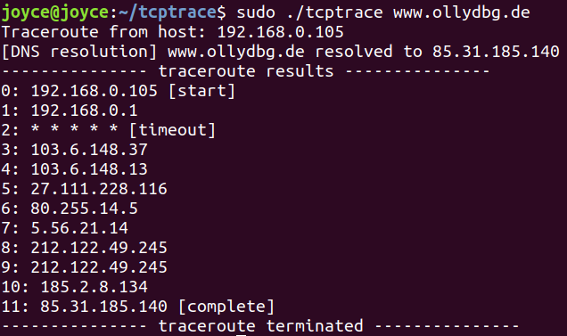

# :flags: tcptrace :flags:

Run with root permissions (`sudo`) because I used raw sockets in this program. 

Note that not all sites can successfully be traced due to firewall permissions and TCP RSTs.

## :dolphin: How it works

The TCP traceroute mechanism is very similar to normal ping traceroute. I used socket errors to detect different types of packets.
